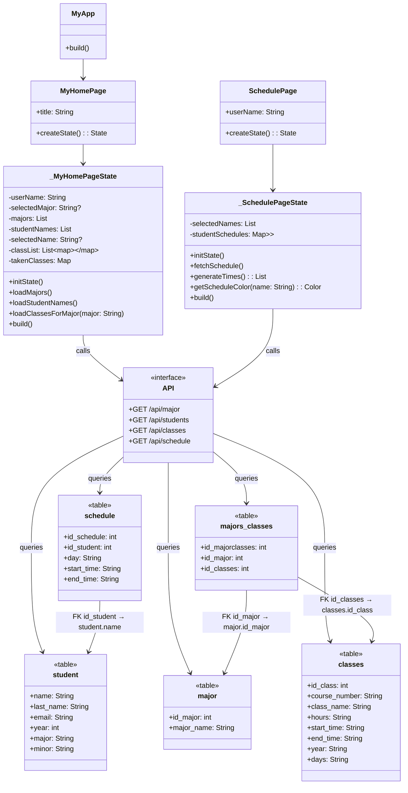

# Scheduling Classes App
### 1.✅ Project Introduction (1 or 2 paragraphs)
__What does your app do?__
This app is designed to identify and display scheduling conflicts among students in the CS386 class (excluding current seniors). The main goal is to visually represent when students' classes overlap, helping users understand which time slots are already occupied. By doing this, the app can assist professors or the registrar's office in finding potential time windows where a new class could be added, without yet considering room or instructor availability.
__Who is the target user?__
The primary users of this app are professors and the registrar’s office, as it supports academic planning. However, the app also includes a feature for students to input the classes they’ve already taken, allowing the system to simulate real-time schedules. This way, users can see a complete view of everyone’s availability and conflicts in one place.
### 2.✅ Design and Architecture

Description of how the app is structured.
Include Mermaid class diagrams for all classes.

# Database Model

### 3.✅ Instructions 
How to install and run the app.
How to use key features (add screenshots or GIFs if helpful).
How do you test it?
### 4.✅Challenges, Role of AI, Insights
What problems did you face and solve?
How did you use AI?
What did you learn about GUI design, programming, or tools?
### 5.✅Next Steps
If you had more time, what would you improve, add, or refactor?
Any features you'd like to explore in the future?
