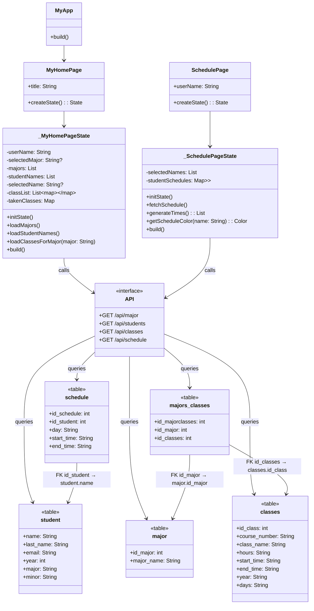

# Scheduling Classes App
### 1.✅ Project Introduction (1 or 2 paragraphs)
__What does your app do?__
This app is designed to identify and display scheduling conflicts among students in the CS386 class (excluding current seniors). The main goal is to visually represent when students' classes overlap, helping users understand which time slots are already occupied. By doing this, the app can assist professors or the registrar's office in finding potential time windows where a new class could be added, without yet considering room or instructor availability.

__Who is the target user?__
The primary users of this app are professors and the registrar’s office, as it supports academic planning. However, the app also includes a feature for students to input the classes they’ve already taken, allowing the system to simulate real-time schedules. This way, users can see a complete view of everyone’s availability and conflicts in one place.
### 2.✅ Design and Architecture

Description of how the app is structured.
Include Mermaid class diagrams for all classes.

# APP MODEL

### 3.✅ Instructions 
__How to install and run the app__
To run the app, it is necessary to follow a few steps. First, the API must be started, and you should wait until the message "Server running on port 3000" appears. Once the server runs, you can proceed to the main Dart file and execute the program using the command "flutter run." In my specific case, no mobile application is installed on my iPhone; instead, I run the program directly through the development environment.

__How to use key features (add screenshots or GIFs if helpful).__
+Using the key features of the program is simple and intuitive. You can choose between three main options depending on what you are looking for.

+First, the "View Student Schedule" section lets you see a full weekly schedule from Monday to Friday. On the right side, you will find a list of student names. By selecting a student's name, you can view their specific schedule, analyze potential conflicts between students, and identify their available time slots.

+Second, the "View Teacher Schedule" section works similarly. You will again see a weekly schedule from Monday to Friday and a list of professors on the right. By selecting a professor’s name, you can view their schedule, analyze conflicts, and check their available times.

+Finally, the "Majors" section lets you select a major and see all the related classes. The course names, dates, times, and the corresponding academic year can be viewed.

+Another feature is the check conflict button in students' and professors' schedules, which allows you to see what dates, times, and people have conflicts.

__How do you test it?__
I use multiple ways to test it:
+I used Postman, which allowed me to send my API request for GET or POST and see if the connection between the database and the API returned the correct information for my program.

+I also used Workbench SQL. Before adding the SQL code in the API, I tried different commands to see which one retrieved the information I needed for each feature in the code. 

+To test the flutter, I ran the code and used the buttons connected to the API to see if they had the information I added. When you choose majors, the API sends a GET to the SQL and puts the majors in the Flutter dropdown button.

### 4.✅Challenges, Role of AI, Insights
__What problems did you face and solve?__

+Setting up the API, connecting it to the database, and integrating it with Flutter presented multiple challenges. Since the API runs on a specific port, I had to configure it correctly and install several packages on my machine to ensure it could run smoothly.

+Integrating the API with Flutter required adding the necessary dependencies and setting up the HTTP environment in Flutter to allow the app to locate and communicate with the API.

__How did you use AI?__
+AI helped to understand what an API does and how to create it. It also helped me to make the Flutter code and know why you need so many lines for a small thing.

__What did you learn about GUI design, programming, or tools?__
Through this project, I learned the importance of keeping the GUI simple and focused, making it easy for users to navigate and find the information they need. I also learned how important it is to properly connect the backend (API) with the frontend (Flutter) to ensure smooth functionality. In terms of programming, I improved my understanding of organizing code, managing state, and structuring screens clearly. Additionally, I gained experience working with Flutter tools and commands like "Flutter run" and handling server responses from the API.

### 5.✅Next Steps
__What would you improve, add, or refactor if you had more time?__
If I had more time, I would add a planning page where users could organize schedules not just for a single semester, but for all the academic years. This would allow for better long-term planning and help visualize a full academic path. Additionally, I would create a special view for professors, where they could access students' schedules directly. This feature would help professors identify conflicts more easily and suggest changes without causing overlaps in other students' schedules. Overall, these improvements would make the system more dynamic, collaborative, and efficient, helping both students and professors manage their time better.

__Do you have any features you'd like to explore in the future?__
In the future, I would like to explore adding automatic conflict detection, where the program highlights overlapping classes or schedules without the user needing to manually check. I would also like to add notifications or alerts when a schedule change affects multiple people. Another feature I would explore is allowing students and professors to propose and approve schedule changes directly through the app, making the process more interactive and efficient.
